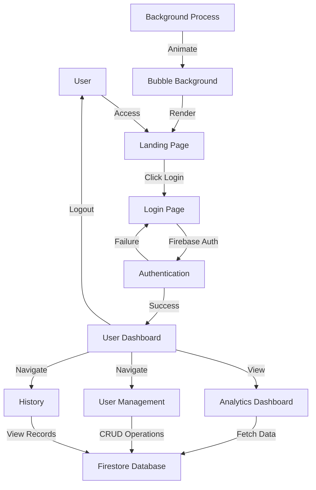

```mermaid
graph TD
    A[User] -->|Access| B[Landing Page]
    B -->|Click Login| C[Login Page]
    C -->|Firebase Auth| D[Authentication]
    D -->|Success| E[User Dashboard]
    D -->|Failure| C
    
    E -->|View| F[Analytics Dashboard]
    E -->|Navigate| G[User Management]
    E -->|Navigate| H[History]
    E -->|Logout| A
    
    F -->|Fetch Data| I[Firestore Database]
    G -->|CRUD Operations| I
    H -->|View Records| I
    
    J[Background Process] -->|Animate| K[Bubble Background]
    K -->|Render| B
```
